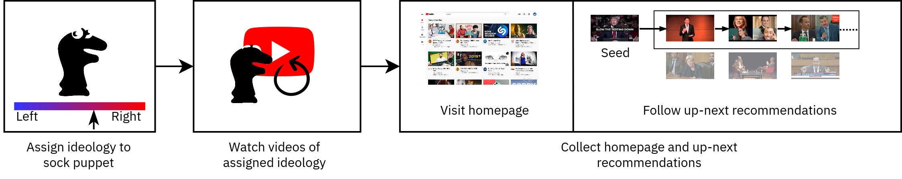

# Longitudinal-Recommendations

## Project Description
Sock puppets are automated browser agents that perform a series of actions to collect some data. In this project, we used sock puppets to collect YouTube recommendations for far-left, left, moderate, right, and far-right YouTube users on a daily basis to see how they vary. We selected a set of videos whose ideology corresponded to the assigned ideology of the sock puppet. Every day, we initialized a new sock puppet that  would first collect the vanilla YouTube homepage. The sock puppet would then sample a 100 videos from this set and watch them (i.e., training). Once trained, the sock puppet would go collect the YouTube homepage recommendations (i.e., testing) and then follow a sequence of up-next recommendations starting from a pre-selected video.

See `Analysis.ipynb` for a primer on how to use the data. We are primarily int

## Data Description
Download the data from [here](https://drive.google.com/file/d/11kb918lusOQHQrPQju7UQI-kA0xgOiwP/view?usp=sharing) and extract it. The data consists of individual JSON files that correspond to each individual sock puppet. Following are the JSON keys and their meaning that can be found in each file.

- puppet_id: a unique ID assigned to each puppet
- start_time: when the sock puppet was started
- end_time: when the sock puppet finished
- duration: how long each video was watched
- description: a general description of the puppet
- actions: a list of sequenced and ordered actions performed by the sock puppet and what data was collected during each action
  - get_homepage: collects the YouTube homepage recommendations inside params
  - get_recommendations: collects the YouTube up-next recommendations inside params, must follow a watch action
  - watch: watches a provided video, params is the video watched
  - training_start: indicates the start of training, no data collected
  - training_end: indicates the end of training, no data collected
  - testing_start: indicates the start of testing, no data collected
  - testing_end: indicates the end of testing, no data collected
- args: a list of input arguments to the sock puppet